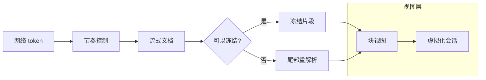
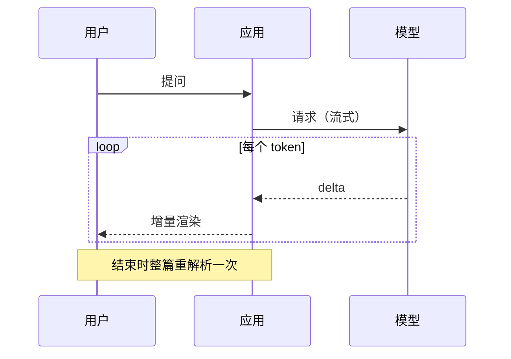
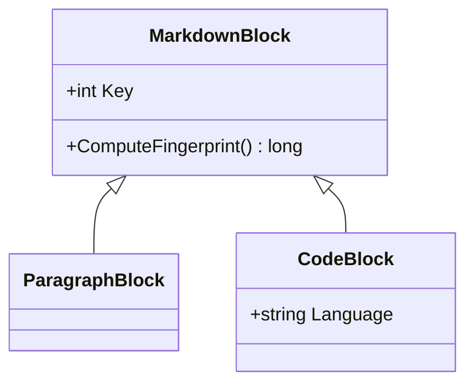
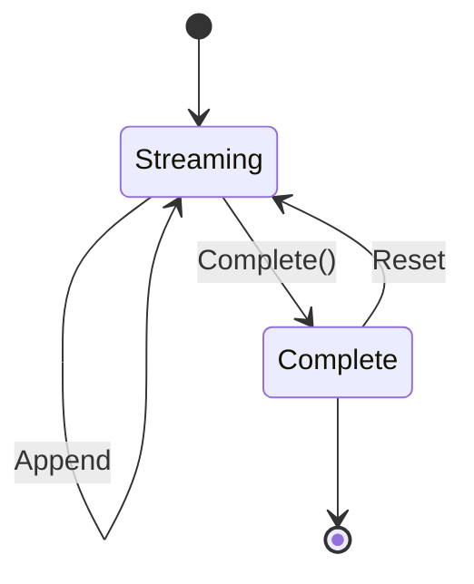
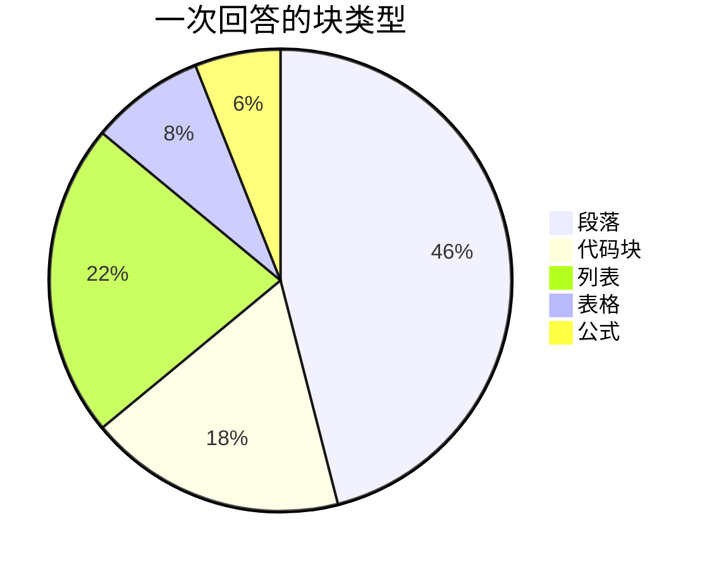
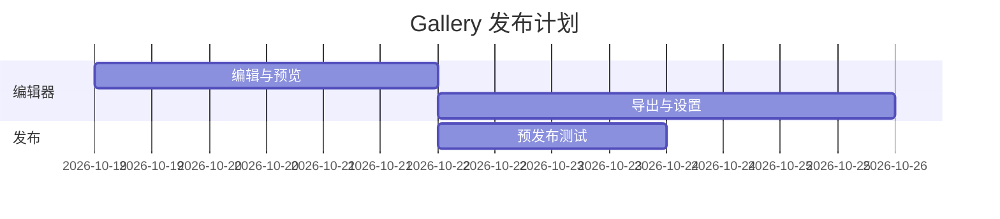

# Mermaid 图表

图表默认复刻 mermaid.js 的官方主题，并跟随亮 / 暗色切换。点击图表可以打开可缩放的查看器。

## 流程图

```mermaid
flowchart LR
    A[网络 token] --> B[节奏控制]
    B --> C[流式文档]
    C --> D{可以冻结?}
    D -->|是| E[冻结片段]
    D -->|否| F[尾部重解析]
    subgraph 视图层
        G[块视图]
        H[虚拟化会话]
    end
    E --> G
    F --> G
    G --> H
```

## 时序图

```mermaid
sequenceDiagram
    participant U as 用户
    participant A as 应用
    participant M as 模型
    U->>A: 提问
    A->>M: 请求（流式）
    loop 每个 token
        M-->>A: delta
        A-->>U: 增量渲染
    end
    Note over A,U: 结束时整篇重解析一次
```

## 类图

```mermaid
classDiagram
    class MarkdownBlock {
        +int Key
        +ComputeFingerprint() long
    }
    class ParagraphBlock
    class CodeBlock {
        +string Language
    }
    MarkdownBlock <|-- ParagraphBlock
    MarkdownBlock <|-- CodeBlock
```

## 状态图

```mermaid
stateDiagram-v2
    [*] --> Streaming
    Streaming --> Streaming : Append
    Streaming --> Complete : Complete()
    Complete --> Streaming : Reset
    Complete --> [*]
```

## 饼图

```mermaid
pie title 一次回答的块类型
    "段落" : 46
    "代码块" : 18
    "列表" : 22
    "表格" : 8
    "公式" : 6
```

## 甘特图

```mermaid
gantt
    title Gallery 发布计划
    dateFormat YYYY-MM-DD
    section 编辑器
    编辑与预览 :a1, 2026-10-19, 3d
    导出与设置 :after a1, 4d
    section 发布
    预发布测试 :2026-10-22, 2d
```
